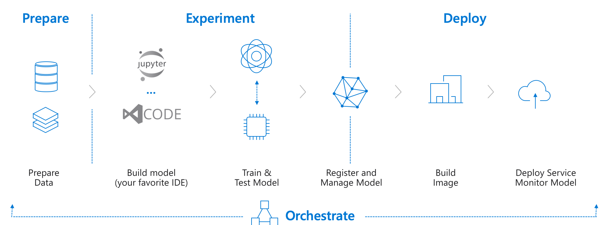

# Azure Machine Learning Bootcamp Materials (Version 1.5)

* 05/2019 - Lots of new capabilities [have been announced](https://azure.microsoft.com/en-us/blog/making-ai-real-for-every-developer-and-every-organization/).
* 12/2019 - Azure Machine Learning is now [general available](https://azure.microsoft.com/en-us/blog/azure-machine-learning-service-a-look-under-the-hood/).

Here are the top two resources you'll need this afternoon:

1. [Azure Machine Learning Services documentation](https://docs.microsoft.com/en-us/azure/machine-learning/service/)
1. [Azure Machine Learning SDK for Python documentation](https://docs.microsoft.com/en-us/python/api/overview/azure/ml/intro?view=azure-ml-py)

# Challenges

## Challenge 1 - Basic model training on Azure

:zap: Here are some **[hints](hints/challenge_01.md)** for this challenge!

In this first challenge, you'll be training a basic machine learning model on Azure. We'll be using the popular MNIST dataset, as it allows us to focus on getting familiar with the mechanics of Azure Machine Learning. MNIST is a data set containing:

* 60000 hand-written digits as training data
* 10000 hand-written digits as testing data

Here are some examples:

The goal is to build a machine learning model, that
* takes an unseen image as an input (28x28 pixels) and
* outputs if there was a 0, 1, 2, 3, 4, 5, 6, 7, 8 or 9 on the image

Guidance:
* Deploy from Azure Portal: `Machine Learning service workspace`
* We'll be writing our code in a Jupyter Notebook in a [Notebook VM](https://docs.microsoft.com/en-us/azure/machine-learning/service/quickstart-run-cloud-notebook)
* Use this file for loading the MNIST data: [`utils.py`](https://raw.githubusercontent.com/CSA-OCP-GER/azure-machine-learning-bootcamp/master/utils.py)
* Use `Python 3.6 - AzureML` as the Notebook type in Jupyter (create a new folder before starting)
* We'll be using `scikit-learn` to build a simple `LogisticRegression` classifier
* Target accuracy of our model on the test data set: `>90%`

## Challenge 2 - Advanced model training on Azure

:zap: Here are some **[hints](hints/challenge_02.md)** for this challenge!

In this challenge, you'll be training a more advanced machine learning model on Azure (in fact, you'll be training a Deep Convolution Neural Network). We'll be using the same data set, but this time, we'll use Azure Machine Learning Compute for speeding up our training.

Guidance:
* Make a copy of the Notebook from Challenge 1
* This time we'll be using `Keras` with a TensorFlow backend to train a Convolution Neural Network on Azure Machine Learning Compute
* Target accuracy of our model on the test data set: `>99%`

## Challenge 3 - Model deployment on Azure

:zap: Here are some **[hints](hints/challenge_03.md)** for this challenge!

In this third challenge, you'll be taking the model you've trained in the first or second challenge and deploy it to Azure Container Instances (ACI). Alternatively, you can deploy it to Azure Kubernetes Service (AKS), but you need to have a look at the [Azure Machine Learning Services documentation](https://docs.microsoft.com/en-us/azure/machine-learning/service/) for that.

Guidance:
* Take the model from challenge 2 and package it as a Docker image (Azure ML will do that for us)
* Reuse the Notebook from challenge 2 (it will already have the Docker base images cached)
* Deploy it on ACI as a scoring service

## Challenge 4 - Automated Machine Learning

:zap: Here are some **[hints](hints/challenge_04.md)** for this challenge!

In this last challenge, you'll be using Automated Machine Learning to let Azure figure out which Machine Learning algorithm performs best on our dataset. We'll do two examples, one code-driven in your Jupyter notebook and one Portal-driven through the Azure Portal

Guidance for code-driven experience:
* Create a new Jupyter Notebook
* Take the [Boston house prices dataset](http://scikit-learn.org/stable/datasets/index.html#boston-dataset)
* Leverage [Automated Machine Learning](https://docs.microsoft.com/en-us/azure/machine-learning/service/tutorial-auto-train-models) to automatically finding the best-performing regression model for predicting house prices

Guidance for Portal-driven, graphical experience:

* Create an `Automated Machine Learning` experiment in your Azure Machine Learning Workspace
* Take the [`pima-indians-diabetes.csv`](../data/pima-indians-diabetes.csv) data set as the input
* Let it figure out the best performing model
* **Bonus points**: Deploy the model to ACI as a scoring endpoint

## Further Challenges

There's a lot more interesting stuff that Azure Machine Learning can do for us. Most likely, we won't get it to it today due to time constraints:

* Secure our model endpoint on ACI/AKS with an authentication key (use `auth_enabled` and [see here](https://docs.microsoft.com/en-us/azure/machine-learning/service/how-to-consume-web-service#connection-information))
* Embed Application Insights into our model for monitoring (look [here](https://docs.microsoft.com/en-us/azure/machine-learning/service/how-to-enable-data-collection) and [here](https://docs.microsoft.com/en-us/azure/machine-learning/service/how-to-enable-app-insights))
* Distributed training in [TensorFlow](https://docs.microsoft.com/en-us/azure/machine-learning/service/how-to-train-tensorflow#distributed-training) or [PyTorch](https://docs.microsoft.com/en-us/azure/machine-learning/service/how-to-train-pytorch#distributed-training)

# Recommended Certifications

* [Exam AI-100: Designing and Implementing an Azure AI Solution](https://www.microsoft.com/en-us/learning/exam-ai-100.aspx) - mostly focussed on AI, Machine Learning and in some cases also IoT as an use case
* [Exam DP-100: Designing and Implementing a Data Science Solution on Azure](https://www.microsoft.com/en-us/learning/exam-dp-100.aspx) - very Data Science focussed, requires general Machine Learning knowledge (methologies, algorithms, etc.)
* [Exam DP-200: Implementing an Azure Data Solution](https://www.microsoft.com/en-us/learning/exam-dp-200.aspx) - focussed on the data side (storing, securing, etc.)
* [Exam DP-201: Designing an Azure Data Solution](https://www.microsoft.com/en-us/learning/exam-dp-201.aspx) - focussed on the data side (storing, securing, etc.)

# Recommended Trainings

* [Microsoft Professional Program for Artificial Intelligence track](https://academy.microsoft.com/en-us/tracks/artificial-intelligence) - extremely in-depth and very extensive training (includes a lot of mandatory hands-on)

# Further Material

* [Azure Machine Learning Samples on GitHub](https://github.com/Azure/MachineLearningNotebooks)
* [Azure Machine Learning Overview](https://azure.microsoft.com/en-us/blog/azure-ai-making-ai-real-for-business/)
* [Azure Machine Learning Overview - What's new](https://azure.microsoft.com/en-us/blog/what-s-new-in-azure-machine-learning-service/)
* [Automated Machine Learning Overview](https://azure.microsoft.com/en-us/blog/announcing-automated-ml-capability-in-azure-machine-learning/)
* [Hyperparameter Tuning](https://docs.microsoft.com/en-us/azure/machine-learning/service/how-to-tune-hyperparameters)
* Distributed Training with [TensorFlow/Keras](https://docs.microsoft.com/en-us/azure/machine-learning/service/how-to-train-tensorflow#distributed-training) and [PyTorch](https://docs.microsoft.com/en-us/azure/machine-learning/service/how-to-train-pytorch#distributed-training)
* [AI Tools for VS Code](https://visualstudio.microsoft.com/downloads/ai-tools-vscode/)
* [PyTorch Support for Azure ML](https://azure.microsoft.com/en-us/blog/world-class-pytorch-support-on-azure/)
* [Azure Machine Learning Pipelines](https://docs.microsoft.com/en-us/azure/machine-learning/service/concept-ml-pipelines)
* [MLOps with Azure ML](https://github.com/microsoft/MLOpsPython) - running a ML Pipeline in Azure DevOps
* [DevOps for AI: Deploying everywhere (Build 2018)](https://www.youtube.com/watch?v=Fo220toRwhM) - might be not fully up to date but gives some good ideas