# Hints for Challenge 1

## Setup part

In the Azure Portal, create a new `Machine Learning service workspace` resource:

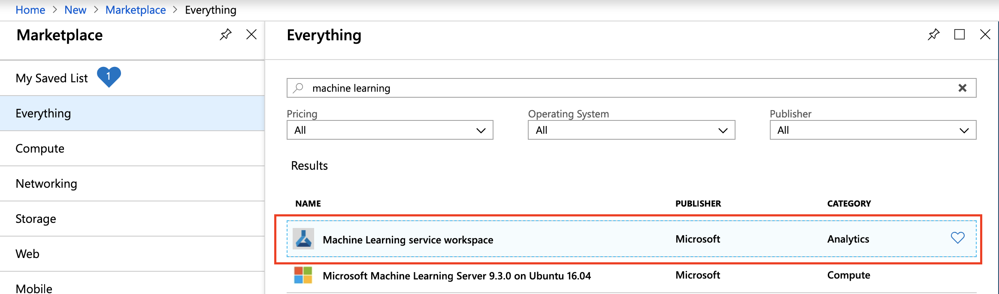

* Workspace name: `azure-ml-bootcamp`
* Resource Group: `azure-ml-bootcamp`
* Location: `East US` (`West Europe` does not always work with the `Free Trial` subscription)

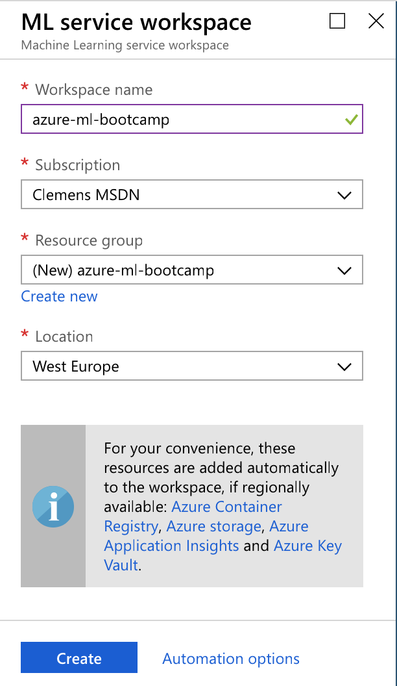

Let's have a look at our Resource Group:

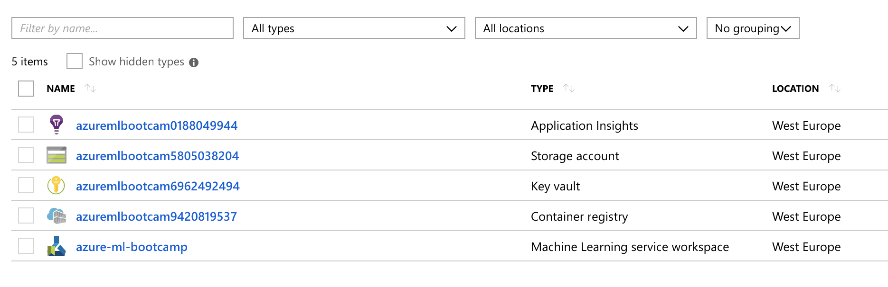

* Application Insights - used for monitoring our models in production
* Storage account - this will store our logs, model outputs, training/testing data, etc.
* Key vault - stores our secrets
* Container registry - stores our containerized models
* Machine Learning service workspace - the centre point for Machine Learning on Azure

# Creating a Data Science VM

First, create a new `Data Science Virtual Machine - Windows 2016`:


In case you see two versions, pick the one with the following description:

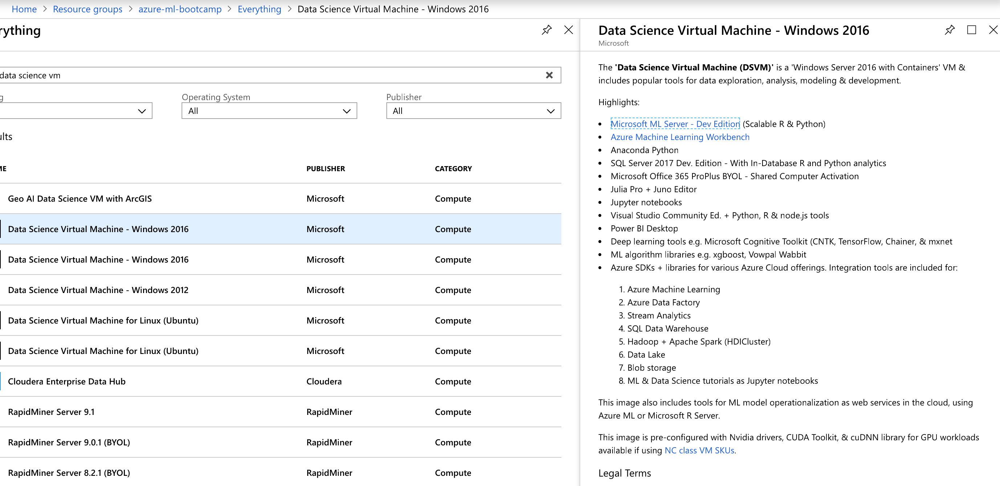

We can keep all the defaults, we just need to make sure that it is also in `East US`:


(Configuration of auto-shutdown might also be a good idea - I know that some of you won't shut this down after the workshop...:satisfied::wink:)

In a real-world setup, we would probably want to use a GPU-enabled instance, but for today we'll keep it simple (...and less expensive). Once the VM has started, connect to it via `RDP`.

First, open up a command shell (`cmd.exe`) and quickly update the Azure Machine Learning SDK to the latest version:

```
conda activate AzureML
pip install --upgrade azureml-sdk[notebooks,automl] azureml-dataprep
```

The `Data Science VM` is usually up-to-date, but since the `Azure Machine Learning Python SDK` is moving forward more quickly, let's make sure we run the latest version.

Next, we'll start up our Jupyter Notebooks on the VM, we'll find the icon straight on the desktop:

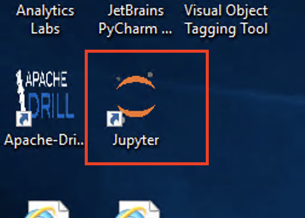

In command line, we can find the URL and the initial token for authentication. With the browser of your choice, open the address printed on the command line on log in. In some cases, IE opens automatically and will directly bring you into Jupyter.

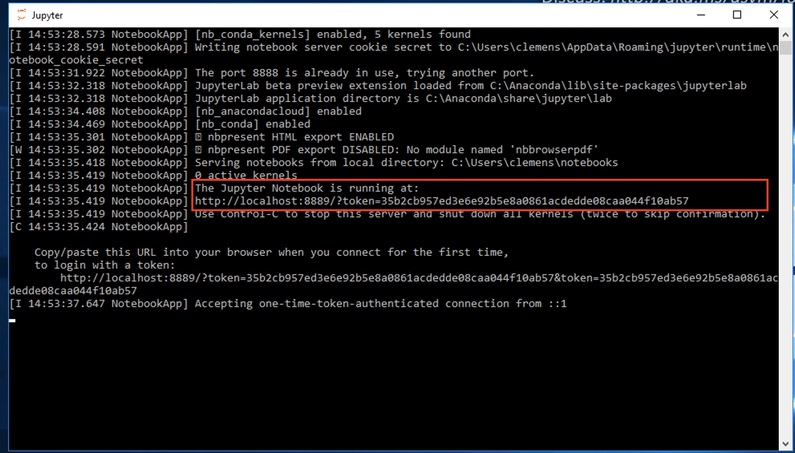

# Initial Azure Machine Learning Setup

Inside the newly created Jupyter instance, first create a new folder via the `New` button on the top right of Jupyter. Everything we'll do in this workshop should happen in this folder. Next, create a text file called `config.json` (also via the `New` button) and replace the values with your own (you'll find your Subscription ID in the Azure Portal at the top of your Resource Group):

```json
{
    "subscription_id": "xxxxxxx-xxxx-xxxx-xxxx-xxxxxxxxx",
    "resource_group": "azure-ml-bootcamp",
    "workspace_name": "azure-ml-bootcamp"
}
```

The `config.json` is used by the `Azure Machine Learning SDK` to connect to your `Azure Machine Learning workspace` running in Azure.

Download [`utils.py`](../utils.py) and upload it into your Jupyter instance (or click `New`, create an empty file called `utils.py` and copy/paste the content, but make sure to only copy the Python code). We'll need this file later for our Machine Learning example code.

Finally, we can click the `New` button and create a new Notebook of type: `Python [conda env:AzureML]`. A new browser tab should open up and we can click the name `Untitled` and rename it to `challenge01.ipynb`.

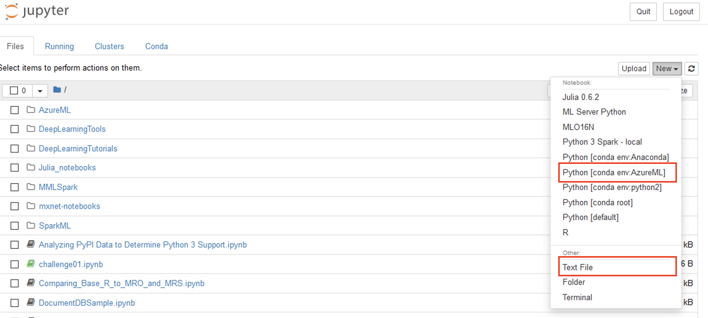

## Training a basic Machine Learning model

Inside your `challenge01.ipynb` notebook, create a new cell:

```python
from azureml.core import Workspace, Experiment, Run

ws = Workspace.from_config()
```

You can run the cell by hitting `Run` or pressing `Shift+Enter`. This cell imports the relevant libraries from the Azure Machine Learning SDK, reads our `config.json` and connects the notebook to our Machine Learning Workspace in Azure. You will need to authenticate to your Azure subscription (a browser window will open, but might not pop to the front - click the IE icon in the taskbar).

***Note (when experiencing subscription ID errors):***

If you are using multiple subscriptions, it might be required to tell the Jupyter Notebook, which one it should use. Hence, create a new cell and adapt the following code to use your subscription id (the one you have used in `config.json`):

```
!az account set -s "xxxxxxx-xxxx-xxxx-xxxx-xxxxxxxxx"
```

Once you have ran the cell, restart the Notebook kernel (`Kernel` --> `Restart & Clear Output`) and wait a few seconds until it has restarted.

Next, let's create a new experiment (this will later show up in our ML Workspace in Azure). This is where all our experiments will be logged to:

```python
experiment = Experiment(workspace = ws, name = "scikit-learn-mnist")
```

Let's load some test data into our notebook. In a later challenge, we'll use Azure Batch AI to train a more powerful model, but for now, we'll train a model with the CPU of the VM that is running our notebook:

```python
import os
import urllib.request

os.makedirs('./data', exist_ok = True)

urllib.request.urlretrieve('http://yann.lecun.com/exdb/mnist/train-images-idx3-ubyte.gz', filename='./data/train-images.gz')
urllib.request.urlretrieve('http://yann.lecun.com/exdb/mnist/train-labels-idx1-ubyte.gz', filename='./data/train-labels.gz')
urllib.request.urlretrieve('http://yann.lecun.com/exdb/mnist/t10k-images-idx3-ubyte.gz', filename='./data/test-images.gz')
urllib.request.urlretrieve('http://yann.lecun.com/exdb/mnist/t10k-labels-idx1-ubyte.gz', filename='./data/test-labels.gz')
```

Let's create a fourth cell for training our model. Make sure that `utils.py` is in the notebook. In case you've forgot to include `utils.py` or added it after you've stared the notebook, you'll need to restart your notebook (via `Kernel --> Restart`) and re-run all the cells.

```python
from utils import load_data
import numpy as np
from sklearn.linear_model import LogisticRegression
from sklearn.externals import joblib

# We need to scale our data to values between 0 and 1
X_train = load_data('./data/train-images.gz', False) / 255.0
y_train = load_data('./data/train-labels.gz', True).reshape(-1)
X_test = load_data('./data/test-images.gz', False) / 255.0
y_test = load_data('./data/test-labels.gz', True).reshape(-1)

# Tell our Azure ML Workspace that a new run is starting
run = experiment.start_logging()

# Create a Logistic Regression classifier and train it
clf = LogisticRegression()
clf.fit(X_train, y_train)

# Predict classes of our testing dataset
y_pred = clf.predict(X_test)

# Calculate accuracy
acc = np.average(y_pred == y_test)
print('Accuracy is', acc)

# Log accuracy to our Azure ML Workspace
run.log('accuracy', acc)

# Tell our Azure ML Workspace that the run has completed
run.complete()
```

On a `Ds3 v2 (4 vcpus, 14 GB memory)` instance, the code should take around 1-2 minutes to run.

In summary, the code does the following things:

1. It imports `sklearn` (Scikit-Learn) as the Machine Learning framework
1. It loads our MNIST train and test data, and scales the values within `[0, 1]`
1. It tells our Azure ML Experiment to start logging a training run
1. It creates a `LogisticRegression`-based classifier and trains it using the training data
1. It then uses the classifier to predict the numbers in the test dataset
1. It compares the predictions to the ground truth and calculated the accuracy score
1. Finally, it logs to accuracy to our run and then finishes the run

As we can see, our model achieves `92%` accuracy, which is pretty low for the MNIST dataset - we'll get back to this in the next challenge!

In the Azure ML Workspace, we can see that our experiment is now showing up:

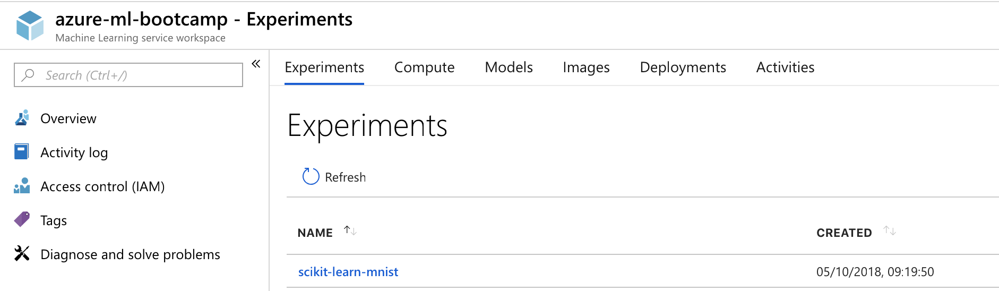

Inside our experiment, we can see our first run:

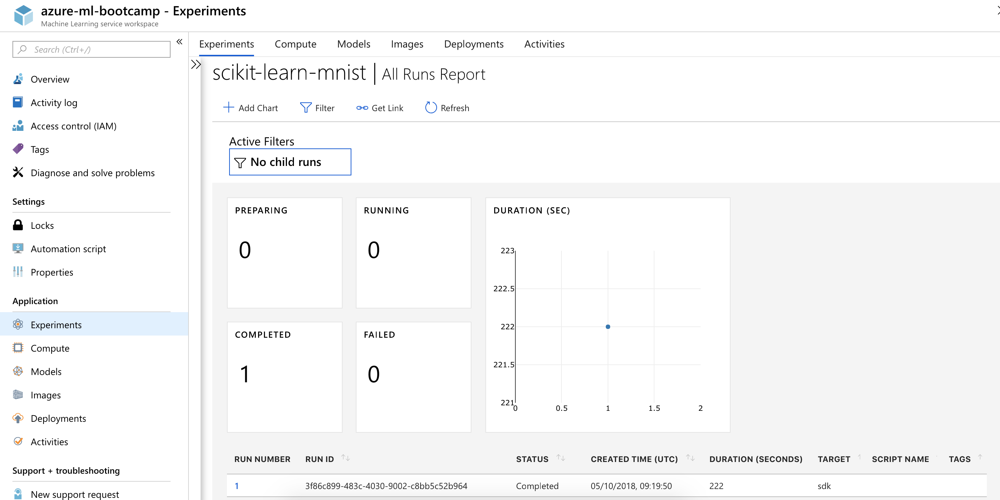

If we click the run number, we can see its details:

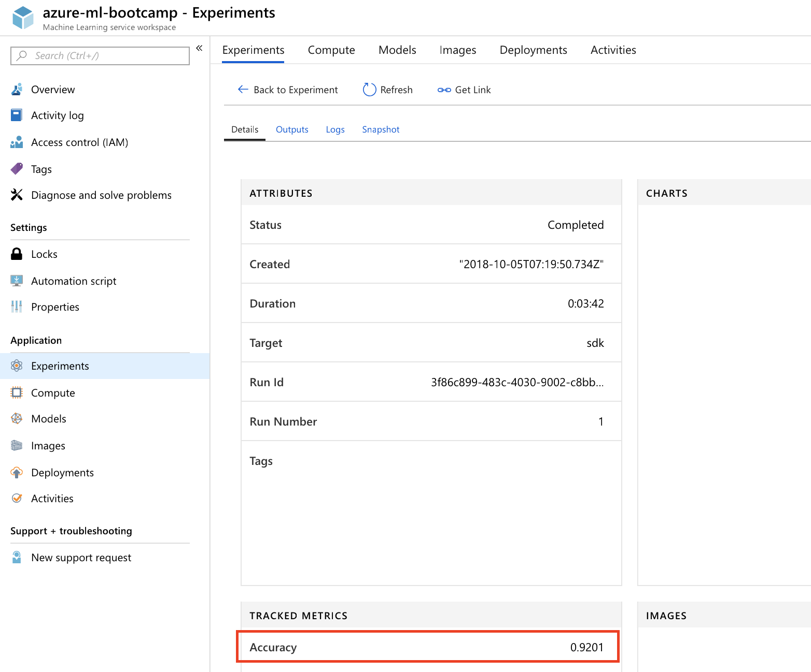

Here we could log more values or even time series, which would directly show up as diagrams. However, as we want to keep the code short, we'll skip this part for now.

Finally, we can export our model and upload it to our Azure ML Workspace:

```python
from sklearn.externals import joblib

# Write model to disk
joblib.dump(value=clf, filename='scikit-learn-mnist.pkl')

# Upload our model to our experiment
run.upload_file(name = 'outputs/scikit-learn-mnist.pkl', path_or_stream = './scikit-learn-mnist.pkl')
```

In the portal, we can see the output of our run:

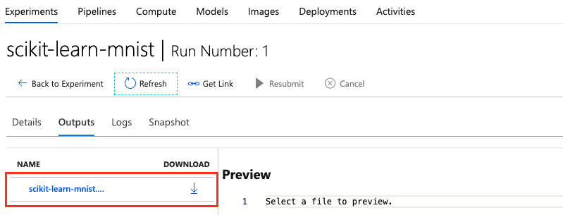

We can also query our logged metrics and outputs for our current run:

```python
print("Run metrics:", run.get_metrics())
print("Run model files", run.get_file_names())
```

As a last step, we can register (version, tag, and store) our model in our workspace:

```python
model = run.register_model(model_name='scikit-learn-mnist-model', model_path='outputs/scikit-learn-mnist.pkl')
print(model.name, model.id, model.version, sep = '\t')
```

Under the `Models` tab, we can now see that our model has been registered:

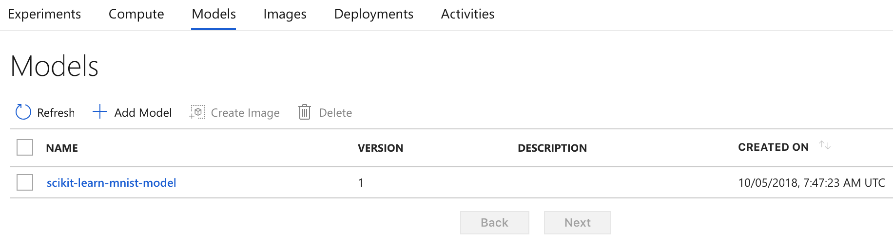

Our model has been stored in the Storage Account that has been created initially for us:

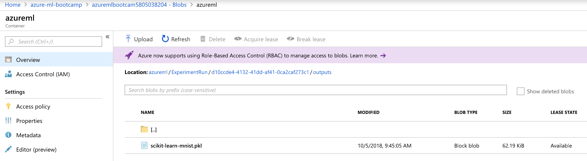

At this point:

* We've trained a Machine Learning model using Scikit-Learn inside our Jupyter Notebook (running in a Data Science VM on Azure)
* We achieved `92%` accuracy (not very good for this data set)
* Azure ML knows about our experiment and our initial run and results
* Azure ML has the output files of our trained model in Blob storage
* We have registered our initial model as a Azure ML Model in our Workspace

In the [next challenge](challenge_02.md), we'll build a more powerful model and use Azure Batch AI to train it on a remote cluster.