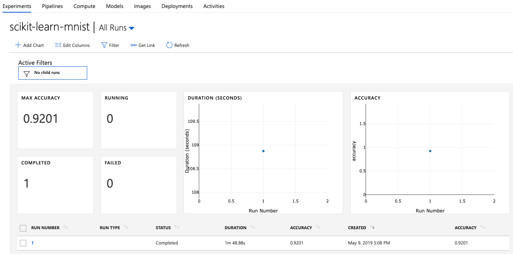

# Hints for Challenge 1

## Setup part

In the Azure Portal, create a new `Machine Learning service workspace (preview)` Service:

* Workspace name: `azure-ml-bootcamp`
* Resource Group: `azure-ml-bootcamp`
* Location: `West Europe` (but does not really matter)


Let's have a look at our Resource Group:


* Application Insights - used for monitoring our models in production
* Storage account - this will store our logs, model outputs, etc.
* Key vault - stores our secrets
* Container registry - stores our containerized models
* Machine Learning service workspace - the centre point for Machine Learning on Azure

Create a free account on [Azure Notebooks](https://notebooks.azure.com). Then, create a new notebook (no need to make it `Public`):


Inside the newly created Azure Notebook, create a `config.json` and replace the values with your own (you'll find your Subscription ID in the Azure Portal at the top of your Resource Group):

```json
{
    "subscription_id": "xxxxxxx-xxxx-xxxx-xxxx-xxxxxxxxx",
    "resource_group": "azure-ml-bootcamp",
    "workspace_name": "azure-ml-bootcamp"
}
```

The `config.json` is used by the Azure Machine Learning SDK to connect to your ML workspace.

Download [`utils.py`](../utils.py) and upload it into your notebook.

Finally, we can create a new Python Notebook where we'll run our code in:


## Training a basic Machine Learning model

Inside your `challenge01.ipynb` notebook, create a new cell:

```python
from azureml.core import Workspace, Experiment, Run

ws = Workspace.from_config()
```

You can run the cell by hitting `Run` or pressing `Shift+Enter`. This cell imports the relevant libraries for Azure Machine Learning, reads our `config.json` and connects the notebook to our Machine Learning Workspace in Azure.

Next, let's create a new experiment (this will later show up in our Workspace in Azure). This is where all our experiments will be logged to:

```python
experiment = Experiment(workspace = ws, name = "scikit-learn-mnist")
```

Let's load some test data into our notebook. In a later step, we'll use Azure Batch AI to train a more powerful model:

```python
import os
import urllib.request

os.makedirs('./data', exist_ok = True)

urllib.request.urlretrieve('http://yann.lecun.com/exdb/mnist/train-images-idx3-ubyte.gz', filename='./data/train-images.gz')
urllib.request.urlretrieve('http://yann.lecun.com/exdb/mnist/train-labels-idx1-ubyte.gz', filename='./data/train-labels.gz')
urllib.request.urlretrieve('http://yann.lecun.com/exdb/mnist/t10k-images-idx3-ubyte.gz', filename='./data/test-images.gz')
urllib.request.urlretrieve('http://yann.lecun.com/exdb/mnist/t10k-labels-idx1-ubyte.gz', filename='./data/test-labels.gz')
```

Let's create a fourth cell for training our model. In case you've forgot to include `utils.py`, you'll need to restart your notebook (via `Kernel --> Restart`).

```python
from utils import load_data
import numpy as np
from sklearn.linear_model import LogisticRegression
from sklearn.externals import joblib

# We need to scale our data to values between 0 and 1
X_train = load_data('./data/train-images.gz', False) / 255.0
y_train = load_data('./data/train-labels.gz', True).reshape(-1)
X_test = load_data('./data/test-images.gz', False) / 255.0
y_test = load_data('./data/test-labels.gz', True).reshape(-1)

# Tell our Azure ML Workspace that a new run is starting
run = experiment.start_logging()

# Create a Logistic Regression classifier and train it
clf = LogisticRegression()
clf.fit(X_train, y_train)

# Predict classes of our testing dataset
y_hat = clf.predict(X_test)

# Calculate accuracy
acc = np.average(y_hat == y_test)
print('Accuracy is', acc)

# Log accuracy to our Azure ML Workspace
run.log('accuracy', np.float(acc))

# Tell our Azure ML Workspace that the run has completed
run.complete()
```

In the Azure ML Workspace, we can see that our experiment is now listing:


Inside our experiment, we can see the runs:



If we click into a run, we can see its details:


Finally, we can export our model and upload it to our Azure ML Workspace:

```python
from sklearn.externals import joblib

joblib.dump(value=clf, filename='scikit-learn-mnist.pkl')
run.upload_file(name = 'outputs/scikit-learn-mnist.pkl', path_or_stream = './scikit-learn-mnist.pkl')
```

In the portal, we can see the output of our run:


We can also query the metrics and outputs for our run:

```python
print("Run metrics:", run.get_metrics())
print("Run model files", run.get_file_names())
```

```python
model = run.register_model(model_name='scikit-learn-mnist-model', model_path='outputs/scikit-learn-mnist.pkl')
print(model.name, model.id, model.version, sep = '\t')
```

Under the `Models` tab, we can now see that our model has been registered:


If we look in the Storage Account that has been created initially for us, we can see that our model has been stored there:


At this point:

* Azure ML knows about our experiment and our initial run
* Azure ML has the output files of our trained model in Blob storage
* We have registered our initial model as a Azure ML Model in our Workspace

