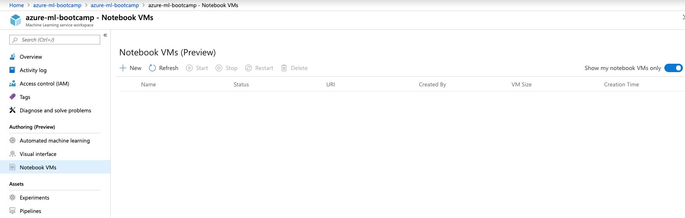
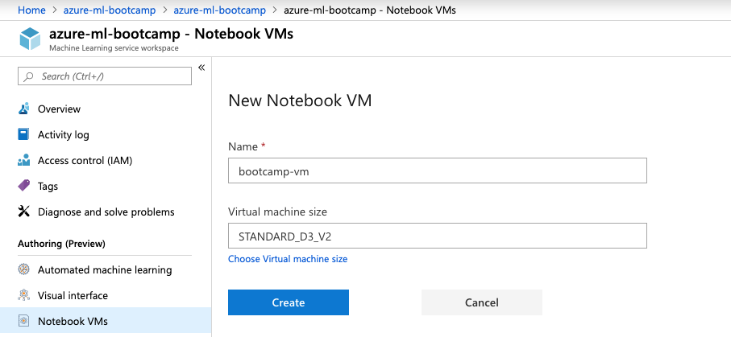
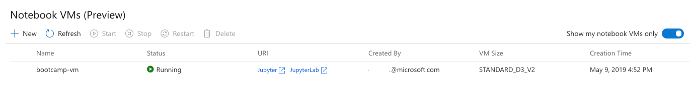
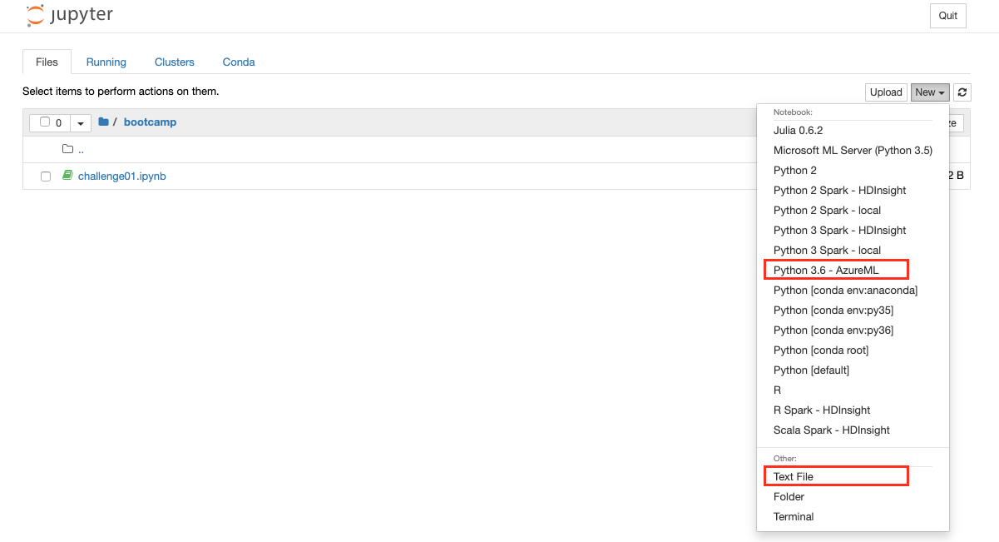
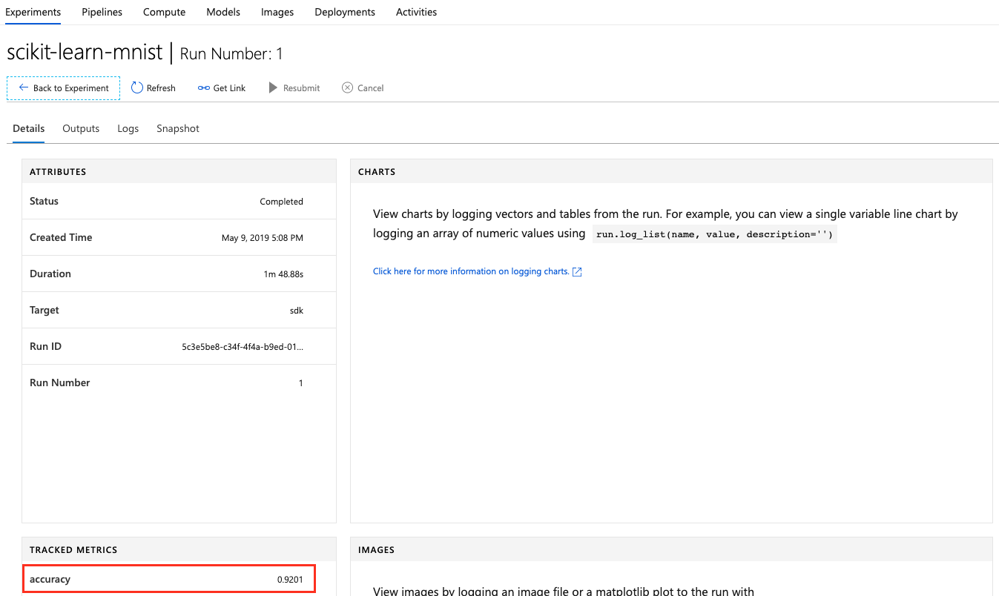
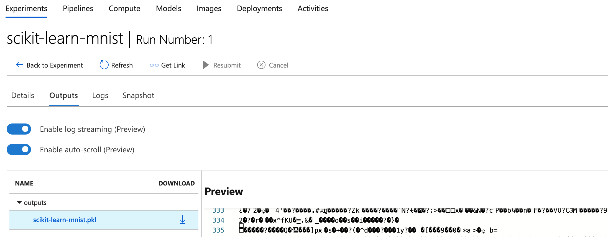
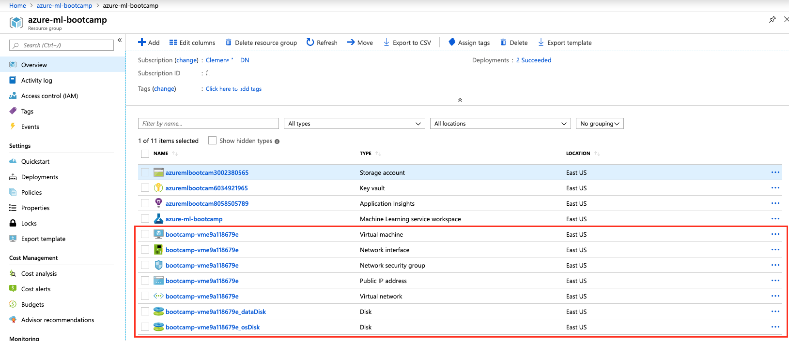
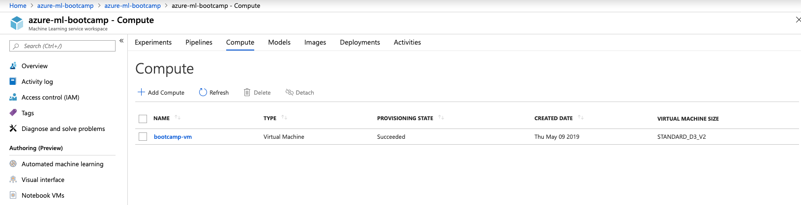

# Hints for Challenge 1

## Setup part

In the Azure Portal, create a new `Machine Learning service workspace` resource:


* Workspace name: `azure-ml-bootcamp`
* Resource Group: `azure-ml-bootcamp`
* Location: `East US` (`West Europe` does not always work with the `Free Trial` subscription)


Let's have a look at our Resource Group:


* Application Insights - used for monitoring our models in production
* Storage account - this will store our logs, model outputs, training/testing data, etc.
* Key vault - stores our secrets
* Machine Learning service workspace - the centre point for Machine Learning on Azure

# Creating a Notebook VM

Inside our `Machine Learning service workspace`, we'll create a new `Notebook VM`:



Hit `+ New` and name it `bootcamp-vm` and keep it as `STANDARD_D3_V2`:



It'll take a few minutes until the VM has been created. The primary use for this VM is that we all have the same Jupyter environment. In this exercise, we'll also use this VM to train a simple Machine Learning model. In a real-world setup, we might even consider using a GPU-enable instance, in case we need to perform Deep Learning.

It'll take around 5-7 minutes until the VM is provisioned and configured.

Once it is running, the UI will already give us a links to `Jupyter` and `JupyterHub`. To keep things simple, we'll use `Jupyter` throughout this bootcamp, but if you feel adventurous, use `JupyerHub`.

You'll be using your AAD (Azure Active Directory) user to log into `Jupyter`. From a enterprise security point, this is a big plus. No extra credentials needed! :raised_hands:



# Initial Azure Machine Learning Setup

Inside the newly created Notebook VM, first create a new folder via the `New` button on the top right of Jupyter. Everything we'll do in this workshop should happen in this folder.

**Note:** The next block is not needed anymore, but you'd need it if you want to connect to your Azure Machine Learning Workspace from e.g., your local machine. Since the `Notebook VM` runs inside the workspace, it knows to which workspace it needs to authenticate.

~~Next, create a text file called `config.json` (also via the `New` button) and replace the values with your own (you'll find your Subscription ID in the Azure Portal at the top of your Resource Group):~~

```json
# Ignore this block, unless you run Jupyer direclty on e.g., your laptop
{
    "subscription_id": "xxxxxxx-xxxx-xxxx-xxxx-xxxxxxxxx",
    "resource_group": "azure-ml-bootcamp",
    "workspace_name": "azure-ml-bootcamp"
}
```

~~The `config.json` is used by the `Azure Machine Learning SDK` to connect to your `Azure Machine Learning workspace` running in Azure.~~

Download [`utils.py`](../utils.py) and upload it into your Jupyter instance (or click `New`, create an empty file called `utils.py` and copy/paste the content, but make sure to only copy the Python code). We'll need this file later for our Machine Learning example code.

Finally, we can click the `New` button and create a new Notebook of type: `Python 3.6 - AzureML`. A new browser tab should open up and we can click the name `Untitled` and rename it to `challenge01.ipynb`.



## Training a basic Machine Learning model

Inside your `challenge01.ipynb` notebook, create a new cell:

```python
from azureml.core import Workspace, Experiment, Run

ws = Workspace.from_config()
```

You can run the cell by hitting `Run` or pressing `Shift+Enter`. Code cells have brackets before them. If the brackets are empty ([ ]), the code has not been run. While the code is running, you see an asterisk([*]). After the code completes, a number [1] appears. The number tells you the order in which the cells ran.

This first cell imports the relevant libraries from the Azure Machine Learning SDK, ~~reads our `config.json`~~ and connects the notebook to our Machine Learning Workspace in Azure. You will need to authenticate to your Azure subscription (a browser window will open, but might not pop to the front - click the IE icon in the taskbar).

***Note (when experiencing subscription ID errors):***

If you are using multiple subscriptions, it might be required to tell the Jupyter Notebook, which one it should use. Hence, create a new cell and adapt the following code to use your subscription id (the one you have used in `config.json`):

```
!az account set -s "xxxxxxx-xxxx-xxxx-xxxx-xxxxxxxxx"
```

Once you have ran the cell, restart the Notebook kernel (`Kernel` --> `Restart & Clear Output`) and wait a few seconds until it has restarted.

Next, let's create a new experiment (this will later show up in our ML Workspace in Azure after you've ran the first experiment). This is where all our experiments will be logged to:

```python
experiment = Experiment(workspace = ws, name = "scikit-learn-mnist")
```

Let's load some test data into our notebook. In a later challenge, we'll use a Azure Machine Learning Compute cluster to train a more powerful model, but for now, we'll train a model with the CPU of the VM that is running our notebook:

```python
import os
import urllib.request

os.makedirs('./data', exist_ok = True)

urllib.request.urlretrieve('http://yann.lecun.com/exdb/mnist/train-images-idx3-ubyte.gz', filename='./data/train-images.gz')
urllib.request.urlretrieve('http://yann.lecun.com/exdb/mnist/train-labels-idx1-ubyte.gz', filename='./data/train-labels.gz')
urllib.request.urlretrieve('http://yann.lecun.com/exdb/mnist/t10k-images-idx3-ubyte.gz', filename='./data/test-images.gz')
urllib.request.urlretrieve('http://yann.lecun.com/exdb/mnist/t10k-labels-idx1-ubyte.gz', filename='./data/test-labels.gz')
```

Let's create a fourth cell for training our model. Make sure that `utils.py` is in the notebook. In case you've forgot to include `utils.py` or added it after you've stared the notebook, you'll need to restart your notebook (via `Kernel --> Restart`) and re-run all the cells.

```python
from utils import load_data
import numpy as np
from sklearn.linear_model import LogisticRegression
from sklearn.externals import joblib

# We need to scale our data to values between 0 and 1
X_train = load_data('./data/train-images.gz', False) / 255.0
y_train = load_data('./data/train-labels.gz', True).reshape(-1)
X_test = load_data('./data/test-images.gz', False) / 255.0
y_test = load_data('./data/test-labels.gz', True).reshape(-1)

# Tell our Azure ML Workspace that a new run is starting
run = experiment.start_logging()

# Create a Logistic Regression classifier and train it
clf = LogisticRegression()
clf.fit(X_train, y_train)

# Predict classes of our testing dataset
y_pred = clf.predict(X_test)

# Calculate accuracy
acc = np.average(y_pred == y_test)
print('Accuracy is', acc)

# Log accuracy to our Azure ML Workspace
run.log('accuracy', acc)

# Tell our Azure ML Workspace that the run has completed
run.complete()
```

On our `STANARD_D3_V2` instance, the code should take around 2-3 minutes to run. Any warnings you get can be ignored.

In summary, the code does the following things:

1. It imports `sklearn` (Scikit-Learn) as the Machine Learning framework
1. It loads our MNIST train and test data, and scales the values within `[0, 1]`
1. It tells our Azure ML Experiment to start logging a training run
1. It creates a `LogisticRegression`-based classifier and trains it using the training data
1. It then uses the classifier to predict the numbers in the test dataset
1. It compares the predictions to the ground truth and calculated the accuracy score
1. Finally, it logs to accuracy to our run and then finishes the run

As we can see, our model achieves `92%` accuracy, which is pretty low for the MNIST dataset - we'll get back to this in the next challenge!

In the Azure ML Workspace, we can see that our experiment is now showing up:


Inside our experiment, we can see our first run:


If we click the run number, we can see its details:



Here we could log more values or even time series, which would directly show up as diagrams. However, as we want to keep the code short, we'll skip this part for now (more on that in challenge 2).

Finally, we can export our model and upload it to our Azure ML Workspace:

```python
from sklearn.externals import joblib

# Write model to disk
joblib.dump(value=clf, filename='scikit-learn-mnist.pkl')

# Upload our model to our experiment
run.upload_file(name = 'outputs/scikit-learn-mnist.pkl', path_or_stream = './scikit-learn-mnist.pkl')
```

In the portal, we can now see the output of our run:



We can also query our logged metrics and outputs for our current run:

```python
print("Run metrics:", run.get_metrics())
print("Run model files", run.get_file_names())
```

As a last step, we can register (version, tag, and store) our model in our workspace:

```python
model = run.register_model(model_name='scikit-learn-mnist-model', model_path='outputs/scikit-learn-mnist.pkl')
print(model.name, model.id, model.version, sep = '\t')
```

Under the `Models` tab, we can now see that our model has been registered:


Our model has been stored in the Storage Account that has been created initially for us:


At this point:

* We've trained a Machine Learning model using Scikit-Learn inside a `Notebook VM` running `Jupyter`
* We achieved `92%` accuracy (not very good for this data set)
* Azure ML knows about our experiment and our initial run and results
* Azure ML has the output files of our trained model in Blob storage
* We have registered our initial model as a Azure ML Model in our Workspace

If we have another look into our resource group `azure-ml-bootcamp`, we can see that the Notebook VM actually sits inside this group:



Furthermore, we can go into our Workspace and also see it listed under `Compute`:



In the [next challenge](challenge_02.md), we'll build a more powerful model and use Azure Machine Learning Compute to train it on a remote cluster.