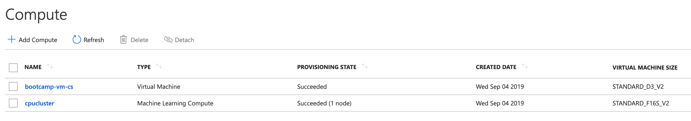
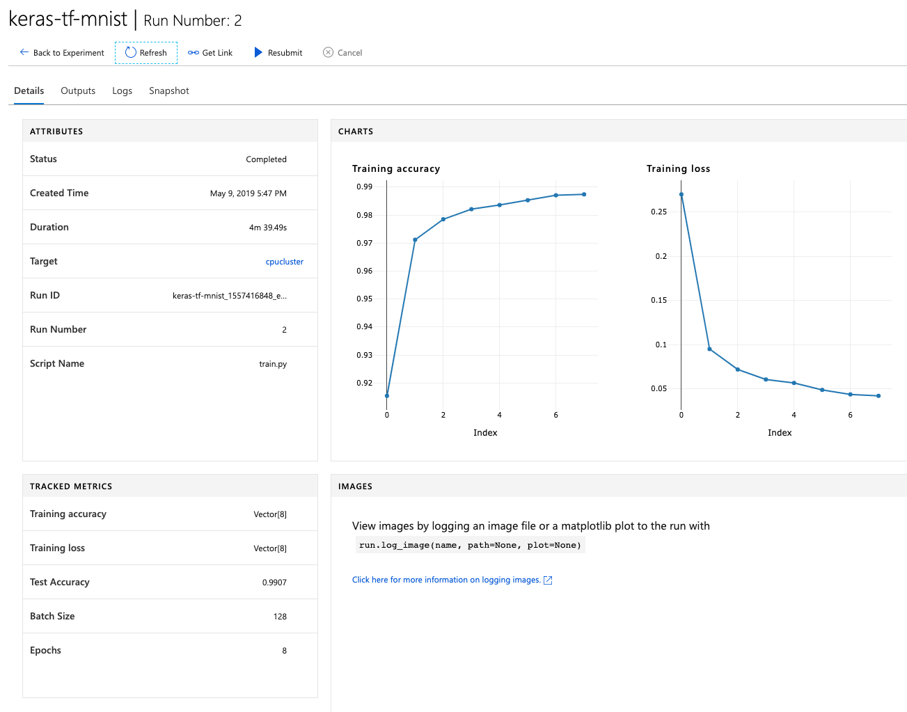

# Hints for Challenge 2

Our model in challenge 1 had an accuracy of `92%`. For the MNIST data set, this is not very good. In order to train a more powerful and complex model, we'll need more compute. Hence, instead of training a model locally in our Azure Notebook, we'll be using [Azure Batch AI](https://azure.microsoft.com/en-us/services/batch-ai/) to train our model on a dedicated compute cluster. As a Machine Learning framework, we'll use Keras with a TensorFlow backend. The good thing is, that the interaction with Azure Machine Learning won't change.

First, let's create a new notebook `challenge02.ipynb` for this challenge.

As before, let's connect to our Azure ML Workspace, but we'll create a new experiment this time:

```python
from azureml.core import Workspace, Experiment, Run
ws = Workspace.from_config()

experiment = Experiment(workspace = ws, name = "keras-tf-mnist")
```

We should still have our MNIST dataset sitting in the `./data/` folder from challenge 1, but just in case, we'll download it again:

```python
import os
import urllib.request

os.makedirs('./data', exist_ok = True)

urllib.request.urlretrieve('http://yann.lecun.com/exdb/mnist/train-images-idx3-ubyte.gz', filename='./data/train-images.gz')
urllib.request.urlretrieve('http://yann.lecun.com/exdb/mnist/train-labels-idx1-ubyte.gz', filename='./data/train-labels.gz')
urllib.request.urlretrieve('http://yann.lecun.com/exdb/mnist/t10k-images-idx3-ubyte.gz', filename='./data/test-images.gz')
urllib.request.urlretrieve('http://yann.lecun.com/exdb/mnist/t10k-labels-idx1-ubyte.gz', filename='./data/test-labels.gz')
```

In this challenge, we'll be training remotely. Therefore, we'll need to access the MNIST dataset inside our Batch AI cluster.

To do so, we'll upload it to the default datastore that our Azure ML Workspace provided for us. This code will retrieve the default datastore (Azure Files) and upload the four files from MNIST into the `./mnist` folder:

```python
ds = ws.get_default_datastore()

print("Datastore details:")
print(ds.datastore_type, ds.account_name, ds.container_name)

ds.upload(src_dir='./data', target_path='mnist', overwrite=True, show_progress=True)
```

If we go to the default Storage Account that the Azure ML Workspace created for us, then select Azure Files, we can see that the dataset has been uploaded:


Next, we can create an empty Batch AI cluster in Azure:

***Note:***
If you are using a `Pay-as-you-Go` or `Free Trial` Azure subscription, you might need to create the Batch AI cluster in the `eastus` region, as `westeurope` is not enabled by default. To do so, just uncomment the `#location='eastus',` line. 

```python
from azureml.core.compute import ComputeTarget, BatchAiCompute
from azureml.core.compute_target import ComputeTargetException

# choose a name for your cluster
batchai_cluster_name = "traincluster"

try:
    # look for the existing cluster by name
    compute_target = ComputeTarget(workspace=ws, name=batchai_cluster_name)
    if type(compute_target) is BatchAiCompute:
        print('found compute target {}, just use it.'.format(batchai_cluster_name))
    else:
        print('{} exists but it is not a Batch AI cluster. Please choose a different name.'.format(batchai_cluster_name))
except ComputeTargetException:
    print('creating a new compute target...')
    compute_config = BatchAiCompute.provisioning_configuration(vm_size="STANDARD_D2_V2", # small CPU-based VM
                                                               #location='eastus', # use eastus location if you are using a free or Pay-as-you-go subscription!
                                                               #vm_priority='lowpriority', # optional
                                                               autoscale_enabled=True,
                                                               cluster_min_nodes=1, 
                                                               cluster_max_nodes=1)

    # create the cluster and wait until it has been provisioned
    compute_target = ComputeTarget.create(ws, batchai_cluster_name, compute_config)
    compute_target.wait_for_completion(show_output=True, min_node_count=None, timeout_in_minutes=20)
    
    # Get the status of our cluster
    print(compute_target.status.serialize())
```

Here we can configure our cluster size, the initial VM count, autoscaling, and most importantly, the VM Size. In our example, we'll stick with a small VM for saving cost. If you want, you can try out a more powerful VM, or even a `NC` instance.

If we now look under the `Compute` tab in our Azure ML Workspace, we can see our Batch AI cluster:



The cluster VMs will take a few minutes to spin up.

In the last challenge, we had all our code in our Azure Notebook. Since we're training remotely now, our Batch AI cluster needs to somehow get the Python code for reading the data and training our model. Hence, we create a `scripts` folder and put our training Python code in it:

```python
import os, shutil

script_folder = './scripts'
os.makedirs(script_folder, exist_ok=True)
shutil.copy('utils.py', script_folder)
```

This cell writes the `train.py` to the `scripts` folder (we could have created it manually and copied it in):

```python
%%writefile $script_folder/train.py

import argparse
import os
import numpy as np

import keras
from keras.datasets import mnist
from keras.models import Sequential
from keras.layers import Dense, Dropout, Flatten
from keras.layers import Conv2D, MaxPooling2D
from keras import backend as K

from azureml.core import Run
from utils import load_data

# input image dimensions and number of classes
img_rows, img_cols = 28, 28
num_classes = 10

# let user feed in parameters
parser = argparse.ArgumentParser()
parser.add_argument('--data-folder', type=str, dest='data_folder', help='data folder mounting point')
parser.add_argument('--batch-size', type=int, dest='batch_size', default=128, help='batch size')
parser.add_argument('--epochs', type=int, dest='epochs', default=12, help='number of epochs')

args = parser.parse_args()
batch_size = args.batch_size
epochs = args.epochs
data_folder = os.path.join(args.data_folder, 'mnist')

print('Data folder:', data_folder)

# load train and test set into numpy arrays and scale
x_train = load_data(os.path.join(data_folder, 'train-images.gz'), False) / 255.0
x_test = load_data(os.path.join(data_folder, 'test-images.gz'), False) / 255.0
y_train = load_data(os.path.join(data_folder, 'train-labels.gz'), True).reshape(-1)
y_test = load_data(os.path.join(data_folder, 'test-labels.gz'), True).reshape(-1)

if K.image_data_format() == 'channels_first':
    x_train = x_train.reshape(x_train.shape[0], 1, img_rows, img_cols)
    x_test = x_test.reshape(x_test.shape[0], 1, img_rows, img_cols)
    input_shape = (1, img_rows, img_cols)
else:
    x_train = x_train.reshape(x_train.shape[0], img_rows, img_cols, 1)
    x_test = x_test.reshape(x_test.shape[0], img_rows, img_cols, 1)
    input_shape = (img_rows, img_cols, 1)
    
# convert class vectors to binary class matrices
y_train = keras.utils.to_categorical(y_train, num_classes)
y_test = keras.utils.to_categorical(y_test, num_classes)

print(x_train.shape)
print(y_train.shape)
print(x_test.shape)
print(y_test.shape)

# get hold of the current run
run = Run.get_submitted_run()

# Design our Convolutional Neural Network
model = Sequential()
model.add(Conv2D(32, kernel_size=(3, 3), activation='relu', input_shape=input_shape))
model.add(Conv2D(64, (3, 3), activation='relu'))
model.add(MaxPooling2D(pool_size=(2, 2)))
model.add(Dropout(0.25))
model.add(Flatten())
model.add(Dense(128, activation='relu'))
model.add(Dropout(0.5))
model.add(Dense(num_classes, activation='softmax'))

model.compile(loss=keras.losses.categorical_crossentropy,
              optimizer=keras.optimizers.Adadelta(),
              metrics=['accuracy'])

train_score = model.fit(x_train, y_train,
                        batch_size=batch_size,
                        epochs=epochs,
                        verbose=1,
                        validation_data=(x_test, y_test))
test_score = model.evaluate(x_test, y_test, verbose=0)

accuracy = np.float(test_score[1])
print('Accuracy is', accuracy)

# Log accuracy to our Azure ML Workspace
run.log('Test Accuracy', accuracy)
run.log_list("Train Accuracy", train_score.history['acc'])
run.log_list("Train Loss", train_score.history['loss'])

# Save model, the outputs folder is automatically uploaded into experiment record by Batch AI
os.makedirs('outputs', exist_ok=True)
model.save('./outputs/keras-tf-mnist.h5')
```

This looks a little bit more complex than our last example! Let's walk through what this script does:

1. We define the input parameters for the script (data folder, batch size, and number of training epochs)
1. We load the data from our Azure Files share
1. We transform the data to the format that `Keras` expects
1. We get hold of the current run (`Run.get_submitted_run()`) - the SDK will manage the run this time
1. We build a Convolution Neural Network with two convolutional layers with ReLu as the activation function, followed by a dense 128 neuron large fully connected layer
1. We let Keras assemble and train the model
1. We run our test data through it and get the predictions
1. We log the train and test accuracies to our experiment
1. We save the model to the `outputs/` folder (Batch AI will automatically upload that folder to the experiment afterwards)

To get the training working, we need to package the scripts and "send" them to Batch AI. Azure ML uses the `Estimator` class for that:

```python
from azureml.train.estimator import Estimator

ds = ws.get_default_datastore()

script_params = {
    '--data-folder': ds.as_mount(),
    '--batch-size': 128,
    '--epochs': 10
}

est = Estimator(source_directory=script_folder,
                script_params=script_params,
                compute_target=compute_target,
                entry_script='train.py',
                conda_packages=['keras'])
```

As you can see, we define where our scripts are, what the compute target should be, and the dependencies (`keras` in this case). Lastly, we also give in the script parameters, for trying out different hyperparameters (not covered here).

**Note**: There is also a separate `TensorFlow` Estimator for just TensorFlow, see [here](https://docs.microsoft.com/en-us/azure/machine-learning/service/how-to-train-tensorflow). Since we want to keep it generic in this challenge, we'll rely on the standard `Estimator`.

Lastly, we can kick off the job:

```python
run = experiment.submit(config=est)
run
```

Submitting the job is an asynchronous call, hence we'll have to keep checking the status (the widget will auto-refresh):

```python
from azureml.train.widgets import RunDetails
RunDetails(run).show()
```

The initial run will take a while, here's why:

In the background, Azure ML will now perform the following steps:

* Package our scripts as a Docker image and push it to our Azure Container Registry (initially this will take ~10 minutes)
* Scale up the Batch AI cluster (if initial size was 0)
* Pull the Docker image to the Batch AI cluster
* Mount the MNIST data from Azure Files to the Batch AI cluster (for fast local access)
* Start the training job
* Publish the results to our Workspace (same as before)

The first run might take 10-25 minutes. Subsequent runs will be significantly faster as the base Docker image will be ready and already pushed. By using a more powerful VM, a single run can be executed in less than a minute (in case you use a GPU-equipped instance, you might need to tell your framework to use it).

In the Batch AI Experiments section, we can see our run:


With the same code as before (this is the strength of Azure ML), we can retrieve the results of our training run:

```python
print("Run metrics:", run.get_metrics())
print("Run model files", run.get_file_names())
```

This time we logged our training details as charts:



This already looks much better, we're now able to predict our test data with over `99%` accuracy!

Lastly, we can register our new model (this is the same code as before):

```python
model = run.register_model(model_name='keras-tf-mnist-model', model_path='outputs/keras-tf-mnist.h5')
print(model.name, model.id, model.version, sep = '\t')
```

If we want, we can also delete our Batch AI cluster (we won't need it in the next challenges):

```python
compute_target.delete()
```

At this point (in addition to the results from challenge 1):

* We used the Azure Machine Learning SDK with Azure Batch AI in the background to train a Convolutional Neural Network (CNN)
* We switched our training framework from Scikit-Learn to Keras with TensorFlow in the backend (without changing any Azure ML code!)
* We registered our new model (>`99%` accuracy) in our Azure ML Workspace

Great, now we have a well performing model. Obviously, we want other people, maybe some developers, make use of it. Therefore, we'll deploy it as an API to production in the [next challenge](challenge_03.md).
