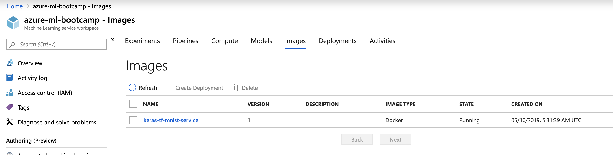
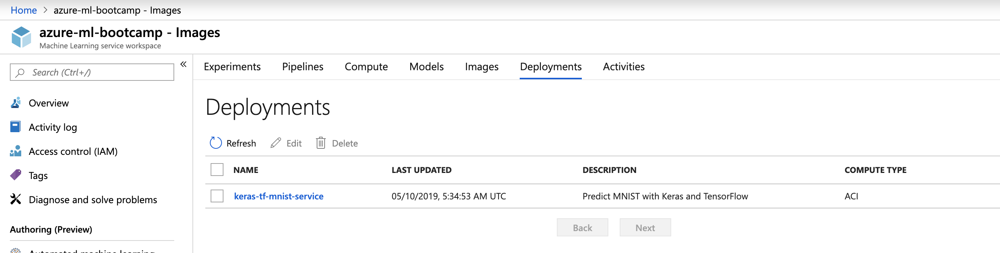

# Hints for Challenge 3

After challenge 2, we finally have a model that an accuracy of more than 99% - time to deploy it to production!
Hence, we'll now be taking the model and we'll deploy it on [Azure Container Instances](https://azure.microsoft.com/en-us/services/container-instances/).

**We'll reuse the same notebook as in challenge 2, as it will have the container images cached.**

Our Azure Subscription must first have the providers for Azure Container Instances enabled:

```python
!az provider show -n Microsoft.ContainerInstance -o table
!az provider register -n Microsoft.ContainerInstance
```

The leading `!` tells the notebook cell to execute the code on the command line inside the Jupyter Notebook's VM.

As before, let's import all necessary libraries and connect to our Workspace (we're probably already connected, but better safe than sorry):

```python
from azureml.core import Workspace, Experiment, Run
import math, random, json

ws = Workspace.from_config()
```

Let's reference our registered model from challenge 2:

```python
from azureml.core.model import Model

model = Model(ws, name="keras-tf-mnist-model")

# Make sure we have the correct model
print(model.name, model.id, model.version, sep = '\t')
```

We need to write a short `score.py` script, that Azure ML understands for loading our model and exposing it as a web service. This file will be packaged as a Docker container so that we can deploy it to ACI.

```python
%%writefile score.py
import json, os, requests
import numpy as np
from io import BytesIO
from PIL import Image
from keras.models import load_model
from azureml.core.model import Model

def init():
    global model
    # retreive the path to the model file using the model name
    model_path = Model.get_model_path('keras-tf-mnist-model')
    model = load_model(model_path)

def run(raw_data):
    image_url = json.loads(raw_data)['image_url']    
    image = Image.open(BytesIO(requests.get(image_url).content))
    img = 1 - (np.array(image.convert('L'), dtype=np.float32).reshape(1, 28, 28, 1) / 255.0)
    # make prediction
    y = model.predict(img)
    return json.dumps({"prediction": int(np.argmax(y)), "probabilities": y.tolist()})
```

We also need to tell Azure ML which dependencies our packaged model has (similar to when we used Azure Machine Learning Compute):

```python
from azureml.core.conda_dependencies import CondaDependencies 

myenv = CondaDependencies()
myenv.add_pip_package("pynacl==1.2.1")
myenv.add_pip_package("keras==2.2.4")
myenv.add_pip_package("tensorflow==1.11.0")
myenv.add_pip_package("pillow==5.3.0")

with open("keras-tf-mnist.yml","w") as f:
    f.write(myenv.serialize_to_string())
```

Finally, we are able to configure Azure Container Instances and deploy our model to production:

```python
from azureml.core.webservice import AciWebservice, Webservice
from azureml.core.image import ContainerImage

aci_config = AciWebservice.deploy_configuration(cpu_cores=1, 
                                                memory_gb=1, 
                                                tags={"data": "MNIST",  "method" : "keras-tf"}, 
                                                description='Predict MNIST with Keras and TensorFlow')

image_config = ContainerImage.image_configuration(execution_script = "score.py", 
                                    runtime = "python", 
                                    conda_file = "keras-tf-mnist.yml")

service = Webservice.deploy_from_model(name = "keras-tf-mnist-service",
                                       deployment_config = aci_config,
                                       models = [model],
                                       image_config = image_config,
                                       workspace = ws)

service.wait_for_deployment(show_output = True)
```

The first deployment should take around 8 minutes, as before, the Docker image needs to be build.

In our Workspace, we can check the `Images` tab:



Shortly after, we should also see our ACI service coming up under the `Deployments` tab:



Lastly, we can print out the service URL and the state of the service:

```python
print(service.state)
print(service.scoring_uri)
```

Let's try to make a request:

```python
import requests
import json

headers = {'Content-Type':'application/json'}
data = '{"image_url": "https://bootcamps.blob.core.windows.net/ml-test-images/4.png"}'

resp = requests.post(service.scoring_uri, data=data, headers=headers)
print("Prediction Results:", resp.text)
```

The prediction results contain the probabilities for the image being a 0, 1, 2, ... or 9.

Here are some more hand-drawn test images:

```
https://bootcamps.blob.core.windows.net/ml-test-images/0.png
https://bootcamps.blob.core.windows.net/ml-test-images/1.png
https://bootcamps.blob.core.windows.net/ml-test-images/2.png
https://bootcamps.blob.core.windows.net/ml-test-images/3.png
https://bootcamps.blob.core.windows.net/ml-test-images/4.png
https://bootcamps.blob.core.windows.net/ml-test-images/5.png
https://bootcamps.blob.core.windows.net/ml-test-images/6.png
https://bootcamps.blob.core.windows.net/ml-test-images/7.png
https://bootcamps.blob.core.windows.net/ml-test-images/8.png
https://bootcamps.blob.core.windows.net/ml-test-images/9.png
```

At this point:

* We took our high-accuracy model from challenge 2 and deployed it on Azure Container Instances as a web service
* We can do simple RESTful API calls to our endpoint for scoring 28x28 pixel sized images

Often, we have a simpler data set and want to figure out how we can best classify or predict certain data points - without trying out a lot of Machine Learning algorithms ourselves. Hence, we'll look at Automated Machine Learning in the [fourth challenge](challenge_04.md).