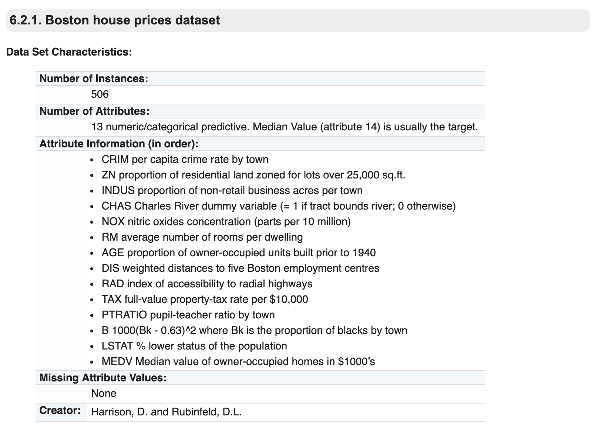
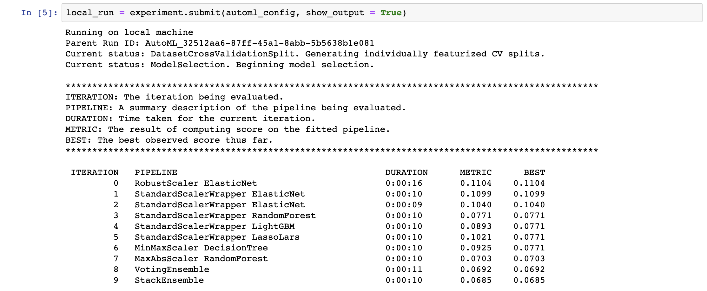
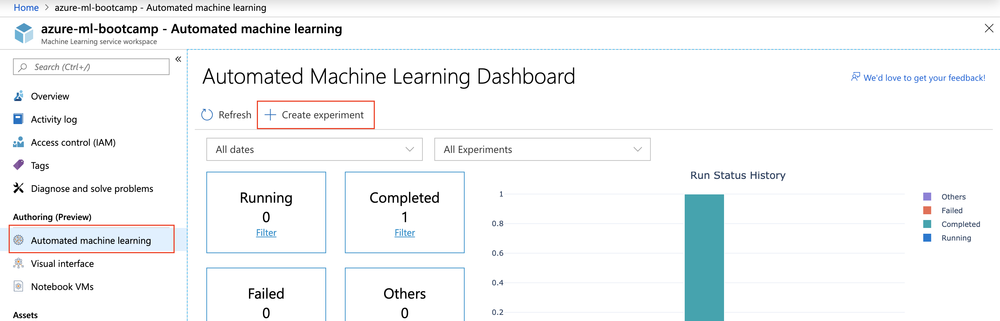
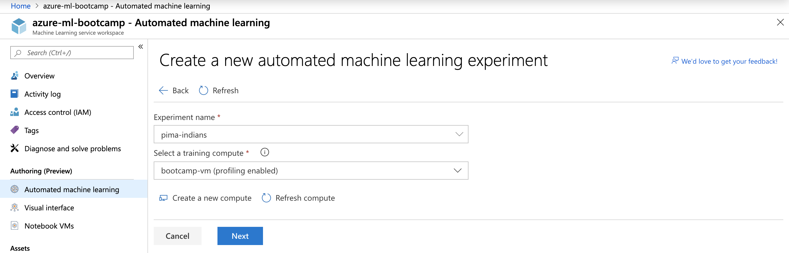
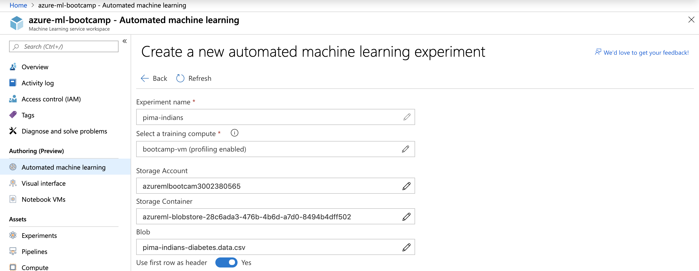
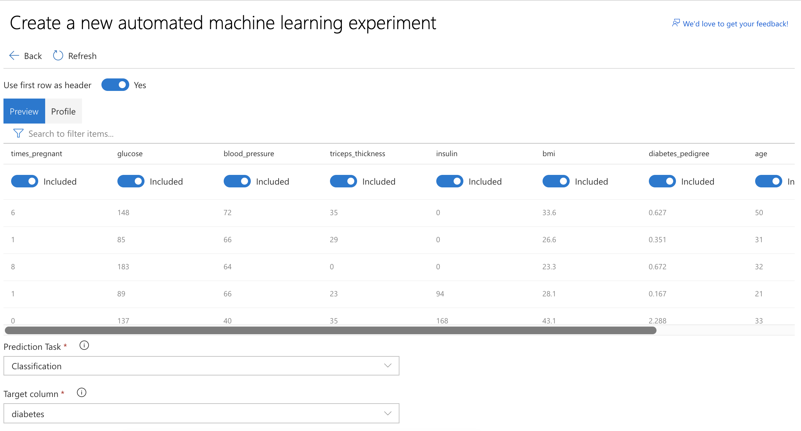
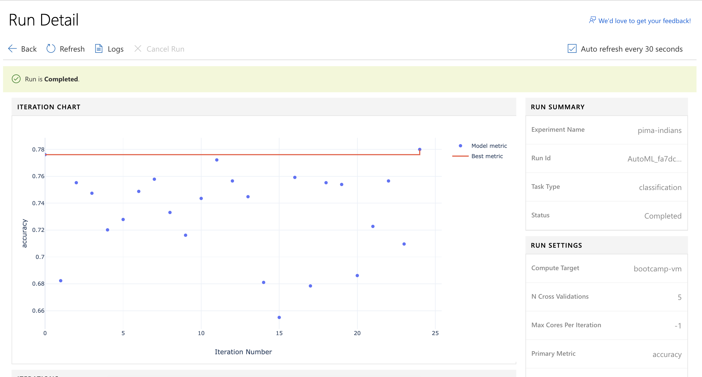
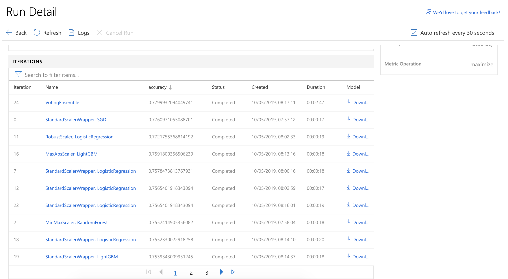

# Hints for Challenge 4

By now, we have a good understanding how Azure Machine Learning works. In this last challenge, we'll take a data set and use Automated Machine Learning for testing out different regression algorithms automatically. Automated Machine Learning is currently able to perform `classification`, `regression` and also `forecasting`.

**Note:** As of May 2019, Automated Machine Learning can also [be used directly from the Azure Portal](https://docs.microsoft.com/en-us/azure/machine-learning/service/how-to-create-portal-experiments). For this challenge, we'll keep using code. We'll do a short example using the Portal below.

## Code-driven

For this challenge, we'll be using the [Boston house prices dataset](http://scikit-learn.org/stable/datasets/index.html#boston-dataset):



Let's create a new notebook called `challenge_04.ipynb`. As always, include our libraries and connect to our Workspace:

```python
import logging

import numpy as np
from sklearn import datasets

import azureml.core
from azureml.core.experiment import Experiment
from azureml.core.workspace import Workspace
from azureml.train.automl import AutoMLConfig
from azureml.train.automl.run import AutoMLRun

ws = Workspace.from_config()
```

```python
experiment_name = 'automl-local-regression'
project_folder = './automl-local-regression'

experiment = Experiment(ws, experiment_name)
```

Let's load our dataset and split it into a train and test set (this time, we didn't get pre-prepared data sets):

```python
from sklearn.datasets import load_boston

from sklearn.linear_model import Ridge
from sklearn.metrics import mean_squared_error
from sklearn.model_selection import train_test_split

X, y = load_boston(return_X_y = True)

X_train, X_test, y_train, y_test = train_test_split(X, y, test_size = 0.2, random_state = 0)
```

Now, we need to configure our Automated Machine Learning project:

```python
automl_config = AutoMLConfig(task = 'regression',
                             iteration_timeout_minutes = 2,
                             iterations = 10,
                             primary_metric = 'normalized_root_mean_squared_error',
                             n_cross_validations = 5,
                             debug_log = 'automl.log',
                             verbosity = logging.INFO,
                             X = X_train, 
                             y = y_train,
                             path = project_folder)
```

This is the most interesting part:

* `task` - Type of problem (classification or regression)
* `primary_metric` - The metric that we want to optimize
* `iteration_timeout_minutes` - Time limit per iteration
* `iterations` - Number of iterations (number of algorithms tested)
* `n_cross_validations` - Number of cross validation splits
* `X` - Training data
* `y` - Training labels
* `path` - Output for configuration files

Depending on your task, there are [a lot more](https://docs.microsoft.com/en-us/python/api/azureml-train-automl/azureml.train.automl.automlconfig(class)?view=azure-ml-py) configuration parameters!

Let's run it locally in our Notebook, as the data isn't too big (depending on the complexity of our data, we would want to use Azure Machine Learning Compute again):

```python
local_run = experiment.submit(automl_config, show_output = True)
```



Once done, we can retrieve the best performing model (in this case, it is a [Pipeline](https://docs.microsoft.com/en-us/azure/machine-learning/service/concept-ml-pipelines)):

```python
best_run, fitted_model = local_run.get_output()
print("Best run:", best_run)
print("Best model:", fitted_model)
```

We can use the best model/pipeline, to score our test data and calculate our accuracy:

```python
y_pred = fitted_model.predict(X_test)

sum_actuals = sum_errors = 0
for actual_val, predict_val in zip(y_test, y_pred):
    abs_error = actual_val - predict_val
    if abs_error < 0:
        abs_error = abs_error * -1

    sum_errors = sum_errors + abs_error
    sum_actuals = sum_actuals + actual_val

mean_abs_percent_error = sum_errors / sum_actuals
print("Model MAPE", mean_abs_percent_error)
print("Model Accuracy", 1 - mean_abs_percent_error)
```

From here, we can have a look at the [following examples](https://github.com/Azure/MachineLearningNotebooks/tree/master/how-to-use-azureml/automated-machine-learning) to see how we can save and [deploy the model](https://github.com/Azure/MachineLearningNotebooks/blob/master/how-to-use-azureml/automated-machine-learning/classification-with-deployment/auto-ml-classification-with-deployment.ipynb).

At this point:

* We took the `Boston house prices dataset` and split it up into a train and test set
* We let Automated Machine Learning evaluate 10 algorithms to predict the house prices in Boston
* We picked the best performing model and ran it against the test dataset to get a final accuracy
* There are a [lot more possibilities](https://docs.microsoft.com/en-us/azure/machine-learning/service/how-to-configure-auto-train) with Automated Machine Learning, especially `Forecasting` is also supported
* A lot more example notebooks for Azure Machine Learning can be found [here on GitHub](https://github.com/Azure/MachineLearningNotebooks)

## Portal-driven

Let's try a similar thing through the Azure Portal. This time, we'll use the `Pima Indians Diabetes` dataset: The Pima Indians Diabetes Dataset involves predicting the onset of diabetes within 5 years in Pima Indians given medical details. Since the Boston Dataset was a `regression` task, this here is a `classification` problem. (You can find more datasets for trying out AutoML on [this website](https://machinelearningmastery.com/standard-machine-learning-datasets/) - the `Wine Quality Dataset` also works well.)

In your Machine Learning workspace, navigate to the `Automated machine learning` section and select `+ Create experiment`. You'll see that our last AutoML experiment with the Boston dataset also shows up here (have a look at it).

Give our new experiment a name and select a compute destination:



We'll just keep using our Notebook VM, but we could also create a new `Azure Machine Learning compute` cluster.



After hitting `Next`, we can upload our data set. I've re-uploaded the data set with headers here: [`pima-indians-diabetes.csv`](../data/pima-indians-diabetes.csv)
 
Once uploaded, we can set the final details:



And we will also see a preview of our data, where we can exclude features and also specify which column we want to predict:



Under `Advanced Settings`, it might be useful to set `Max concurrent iterations` to `4`, so that we utilize all cores available. 

Once we start training, it'll take a few minutes to ramp up the experiment. Overall, the 25 iterations take quite a while. Once they are through, you should see something like this:



And the details per run:



From here, we can download the `.pkl` file per run. Deploying the best model is not yet possible through the Azure Portal (as of May 2019) - however, we could use the Python SDK to perform those [steps in code](https://github.com/Azure/MachineLearningNotebooks/blob/master/how-to-use-azureml/automated-machine-learning/classification-with-deployment/auto-ml-classification-with-deployment.ipynb).

At this point:

* We took the `Pima Indians Diabetes Dataset` and ran automated Automated Machine Learning for classification on it
* We evaluated 25 algorithms and achieved an accuracy of ~77.9%
* From here, we could start further experimentation by taking the best performing pre-processing & algorithm and as a starting point
