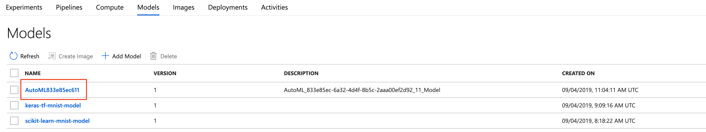
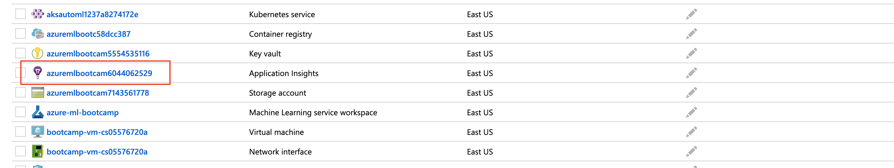
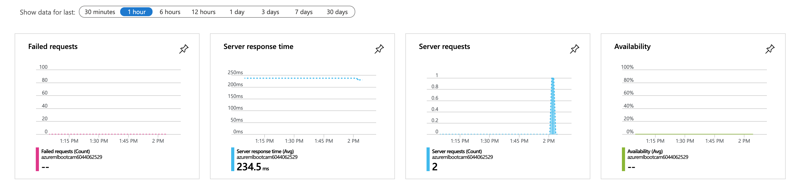
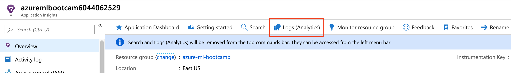
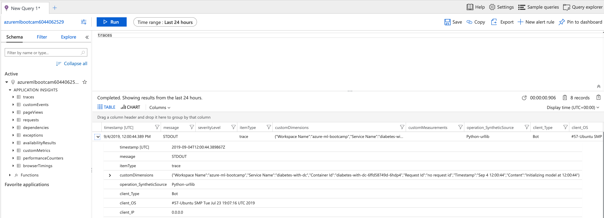
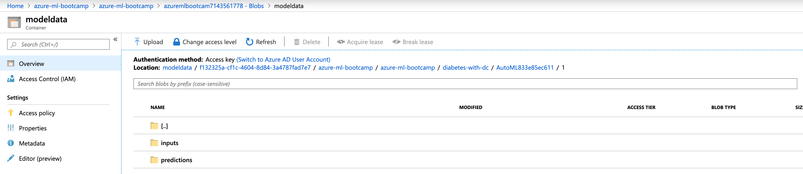
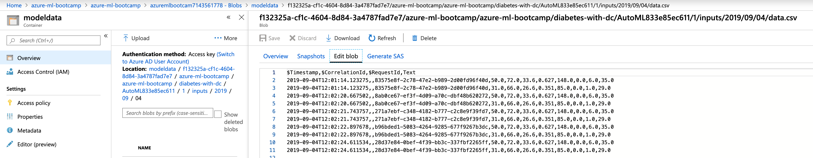
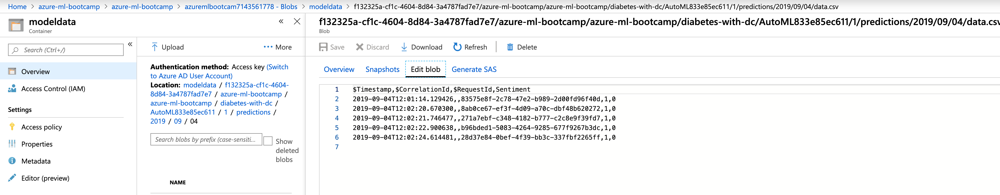

# Hints for Challenge 5

In this challenge we will be re-using the model from challenge 4, but this time we'll deploy to Azure Kubernetes Service (AKS). We'll also enable the following features:

* Authentication - users of our API will require an authentication key to use the model
* Data Collection - every single data input and prediction result will be logged to Azure Blob (this allows us to ultimately detect data drift and re-tune our model, but we won't show this here)
* Monitoring - we'll be using Application Insights for monitoring telemetry data of our model

Sounds good? Let's get started (we'll be done after this)!

Back to Jupyter now, and let's create a notebook called `challenge05.ipynb`. First, we'll import the necessary packages and connect to our workspace:

```python
from azureml.core import Workspace
from azureml.core.compute import AksCompute, ComputeTarget
from azureml.core.webservice import Webservice, AksWebservice
from azureml.core.model import Model

import azureml.core

ws = Workspace.from_config()
```

## Containerizing our model

Next, we want to re-use the model we've registered in challenge 4. We can either look up the model name in the Portal (under our workspace in `Models`), or list our models in Python:



```python
models = Model.list(ws)
print(models)
```

Lastly, we'll pick the model we've generated in challenge 4 (it should be called something like `AutoML...`):

```python
model = Model(ws, name="AutoMLxxxxxxxxx")
print(model.name, model.id, model.version, sep = '\t')
```

As before, we need a `score.py` and a `conda.yaml` for creating a containerized version of our mode. In this case, I've taken the auto-generated files from the portal and adapted them a bit.

For the `conda.yaml`, we need to add pip dependencies for `azureml-defaults` and `azureml-monitoring`:

```python
%%writefile conda.yaml
name: project_environment
dependencies:
- python=3.6.2

- pip:
  - azureml-train-automl==1.0.60 # Required because we are using AutoML
  - inference-schema
  - azureml-defaults # Required for deployment to AKS
  - azureml-monitoring # Required for model monitoring
- numpy
- pandas
- scikit-learn
- py-xgboost<=0.80
channels:
- conda-forge
```

For our scoring script, we want to leverage the `ModelDataCollector` for collecting input data and prediction results to Azure Blob (make sure to set the `model_name`!):

```python
%%writefile score.py
import pickle
import json
import numpy as np
import pandas as pd
import time
import azureml.train.automl
from sklearn.externals import joblib
from azureml.core.model import Model
from azureml.monitoring import ModelDataCollector

from inference_schema.schema_decorators import input_schema, output_schema
from inference_schema.parameter_types.numpy_parameter_type import NumpyParameterType
from inference_schema.parameter_types.pandas_parameter_type import PandasParameterType

input_sample = pd.DataFrame(data=[{"times_pregnant":6.0,"glucose":148.0,"blood_pressure":72.0,"triceps_thickness":35.0,"insulin":0.0,"bmi":33.6,"diabetes_pedigree":0.627,"age":50.0}])
output_sample = np.array([0])


def init():
    global model
    model_name = 'AutoMLxxxxx' # Replace with your model id
    print ("Initializing model at " + time.strftime("%H:%M:%S"))
    model_path = Model.get_model_path(model_name = model_name)
    model = joblib.load(model_path)
    global inputs_dc, prediction_dc
    inputs_dc = ModelDataCollector(model_name,
                                   identifier="inputs",
                                   feature_names=["Text"]) 
    prediction_dc = ModelDataCollector(model_name,
                                       identifier="predictions",
                                       feature_names=["Sentiment"]) 

@input_schema('data', PandasParameterType(input_sample))
@output_schema(NumpyParameterType(output_sample))
def run(data):
    
    try:
        result = model.predict(data)
        
        print("Saving input data and output prediction at " + time.strftime("%H:%M:%S"))
        inputs_dc.collect(data)
        prediction_dc.collect(result)
        
        return result.tolist()
    except Exception as e:
        result = str(e)
        return json.dumps({"error": result})
    return json.dumps({"result": result.tolist()})
```

Let's create an image, this should take around 6-7 minutes:

```python
from azureml.core.image import ContainerImage

image_config = ContainerImage.image_configuration(execution_script = "score.py",
                                                  runtime = "python",
                                                  conda_file = "conda.yaml",
                                                  description = "Diabetes API",
                                                  tags = {'datasource': "Diabetes dataset"})

image = ContainerImage.create(name = "diabetes-with-dc",
                              models = [model],
                              image_config = image_config,
                              workspace = ws)

image.wait_for_creation(show_output = True)
```

## Deployment to AKS

Let's first create an AKS cluster, which will take around 10-15 minutes. We'll keep it with defaults, even though it needs to be stated that there are [plenty of configuration options](https://docs.microsoft.com/en-us/azure/machine-learning/service/how-to-deploy-azure-kubernetes-service#deploy-to-aks). We can also re-use an existing cluster, but let's keep it simple:

```python
aks_name = 'aksautoml123' 

cts = ws.compute_targets

if aks_name in cts and cts[aks_name].type == 'AKS':
    print('Found existing AKS cluster, will use it!')
    aks_target = cts[aks_name]
else:
    print('Creating a new AKS cluster...')
    prov_config = AksCompute.provisioning_configuration()
    aks_target = ComputeTarget.create(workspace = ws, 
                                  name = aks_name, 
                                  provisioning_configuration = prov_config)
    print('Waiting for cluster creation completion...')
    aks_target.wait_for_completion(show_output = True)

print('Cluster state:', aks_target.provisioning_state)
print('Cluster is ready!', aks_target)
```

Lastly, we can deploy our image (should take 1-2 minutes):

```python
aks_config = AksWebservice.deploy_configuration(collect_model_data=True,
                                                enable_app_insights=True)

aks_service_name ='diabetes-with-dc'

wss = Webservice.list(workspace = ws, compute_type='AKS')

if any(ws.name == aks_service_name for ws in wss):
    print('Model with same name already deployed')
else:
    if aks_target.provisioning_state == "Succeeded":
        aks_service = Webservice.deploy_from_image(workspace = ws, 
                                                   name = aks_service_name,
                                                   image = image,
                                                   deployment_config = aks_config,
                                                   deployment_target = aks_target)
        aks_service.wait_for_deployment(show_output = True)
        print('Service state:', aks_service.state)
        print('Service details:', aks_service)
    else: 
        raise ValueError("Failed to deploy service to AKS - Error: ", aks_service.error)
```

And finally, we can score some data after having retrieved the `keys` for accessing the service:

```python
import requests
import json

key1, Key2 = aks_service.get_keys()

headers = {'Content-Type':'application/json',
           'Authorization': 'Bearer ' + key1}

data = {"data": [{
    "times_pregnant": 6,
    "glucose": 148,
    "blood_pressure": 72,
    "triceps_thickness": 35,
    "insulin": 0,
    "bmi": 33.6,
    "diabetes_pedigree": 0.627,
    "age": 50
},
{
    "times_pregnant": 1,
    "glucose": 85,
    "blood_pressure": 66,
    "triceps_thickness": 29,
    "insulin": 0,
    "bmi": 26.6,
    "diabetes_pedigree": 0.351,
    "age": 31
    
}]}

resp = requests.post(aks_service.scoring_uri, json=data, headers=headers)
print("Prediction Results:", resp.json())
```

## Monitoring and Data Collection

After firing a few more API calls, we should now see our model monitoring data and data collection data coming in. Data collection usually takes 15 minutes to warm up, so let's start looking at Application Insights first.

### Monitoring with Application Insights

Navigate to your original resource group and select your Application Insights instance:



We'll be greeted with some telemetry metrics of our model:



Next, let's navigate to `Logs (Analytics)`:



Enter `traces` in the query text field and hit run:



From here, we can start building more complex queries, set alarms or start exploring what is happening with our models.

### Data Collection

Navigate to the Storage Account that is associated to your workspace (named something like `azuremlbootcam*`) and select Blob. From here, we select the `modeldata` container and click through until we see the `inputs` and `prediction` folders:



In each folder, data collection will separate the input and prediction data by day. If we click through, we get to a `data.csv` file, containing our input and prediction data.

Collected input data:



And corresponding prediction data:



We could now use this data to [visualize what our model is predicting](https://docs.microsoft.com/bs-latn-ba/azure/machine-learning/service/how-to-enable-data-collection#validate-your-data-and-analyze-it), use it for re-training (after validating if the predictions are correct) or detecting data drift.

Lastly, we can delete our API service and also the AKS cluster:

```python
aks_service.delete()
aks_target.delete()
```

At this point:

* We've deployed our model from AutoML to Azure Kubernetes Service
* We've enabled authentication to protect our API endpoint (we can also enable [token-based authentication](https://docs.microsoft.com/en-us/azure/machine-learning/service/how-to-deploy-azure-kubernetes-service#authentication-with-tokens))
* We've used Application Insights to monitor model telemetry - this will allow us to set alarms if the model is down or getting slow
* We've used data collection to collect input data and associated predictions to further enhance our mode

That's it for today - Well done! :clap: